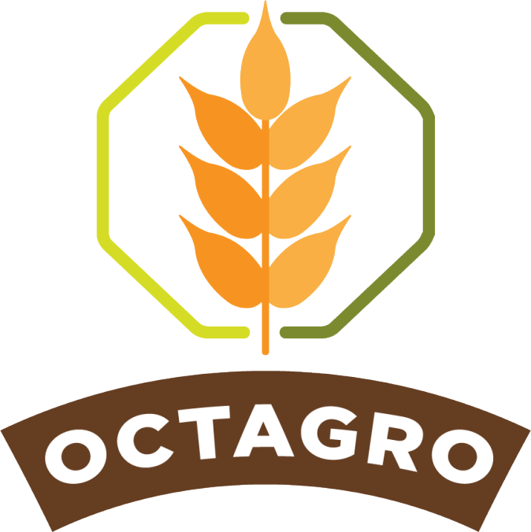
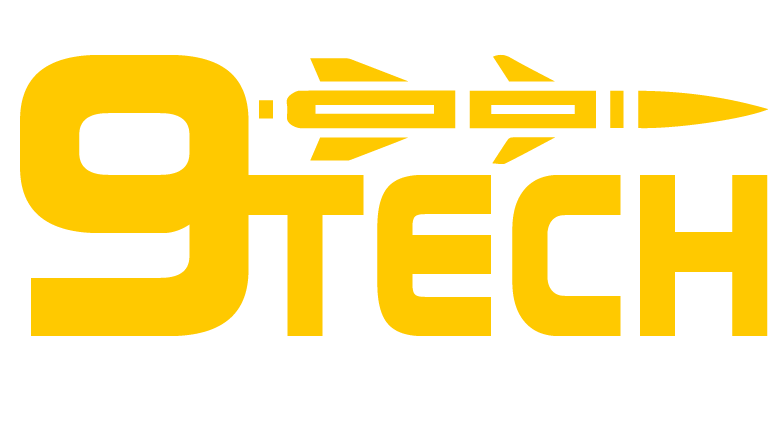

<h2 id="sumario">Sumário</h2>

★ <a href="#sobre">Sobre mim</a>

☰ <a href="#projetos">Meus Projetos</a>

<ul><a href="#octoplus">1º Semestre ┆ 2/2022 ┆ Octoplus</a>
  

    
Detalhes

    <ul>◻️ <a href="#tecnologias-utilizadas">Tecnologias Utilizadas</a></ul>
    <ul>◻️ <a href="#contribuições-pessoais">Contribuições Pessoais</a></ul>
    <ul>◻️ <a href="#lições-aprendidas">Lições Aprendidas</a>
    <ul>◻️ <a href="#hard-skills">Hard Skills</a></ul>
    <ul>◻️ <a href="#hard-skills">Soft Skills</a></ul>
    </ul>
  

</ul>

<ul><a href="#octagro">2º Semestre ┆ 1/2023 ┆ Octagro</a>
  

    
Detalhes

    <ul>◻️ <a href="#tecnologias-utilizadas-">Tecnologias Utilizadas</a></ul>
    <ul>◻️ <a href="#contribuições-pessoais-">Contribuições Pessoais</a></ul>
    <ul>◻️ <a href="#lições-aprendidas-">Lições Aprendidas</a>
    <ul>◻️ <a href="#hard-skills-">Hard Skills</a></ul>
    <ul>◻️ <a href="#hard-skills-">Soft Skills</a></ul>
    </ul>
  

</ul>

<ul><a href="#ninetech">3º Semestre ┆ 2/2023 ┆ Ninetech</a>
  

    
Detalhes

    <ul>◻️ <a href="#tecnologias-utilizadas--">Tecnologias Utilizadas</a></ul>
    <ul>◻️ <a href="#contribuições-pessoais--">Contribuições Pessoais</a></ul>
    <ul>◻️ <a href="#lições-aprendidas--">Lições Aprendidas</a>
    <ul>◻️ <a href="#hard-skills--">Hard Skills</a></ul>
    <ul>◻️ <a href="#hard-skills--">Soft Skills</a></ul>
    </ul>
  

</ul>

<h2>Sobre mim</h2>

</img>

Meu nome é Thiago Zani e estou atualmente em transição de carreira, trazendo uma bagagem diversificada e uma paixão por aprendizado contínuo. Sou formado em Educação Física pela Unesp de Bauru, onde adquiri uma sólida base em educação e prática esportiva. Ao longo da minha jornada, tive o privilégio de atuar como professor de Educação Física na rede pública de ensino do estado de São Paulo, além de experiências enriquecedoras nos colégios Univap - Unidade Aquarius e Centro.

Com o intuito de explorar novos horizontes e buscar uma conexão entre minha experiência prévia e meu interesse em tecnologia, estou atualmente cursando o 3º semestre do curso de Desenvolvimento de Software Multiplataformas na FATEC de São José dos Campos. Durante este período, tenho me dedicado ao desenvolvimento na área de Front-end, participando ativamente de projetos desafiadores que têm aprimorado minhas habilidades técnicas e criativas.

Destaco minha participação como bolsista do Centro Paula Souza no primeiro semestre de 2023, onde estive envolvido em um projeto de monitoria focado na experiência do usuário. Essa oportunidade foi fundamental para expandir meu conhecimento sobre a importância do design centrado no usuário na criação de soluções tecnológicas eficientes.

Além disso, desde julho de 2023, tenho a honra de contribuir com um projeto de Iniciação Científica com bolsa CNPq no renomado Instituto Nacional de Pesquisas Espaciais (INPE), sob a orientação do Prof. Dr. Fabricio G M Carvalho. Neste projeto, estou imerso no fascinante mundo da pesquisa, explorando novas fronteiras e aplicando meus conhecimentos em Desenvolvimento de Software para contribuir com avanços científicos significativos.

Minha jornada até aqui tem sido marcada por uma combinação única de experiências em educação e tecnologia, e estou entusiasmado com a perspectiva de continuar aprendendo, crescendo e explorando novas oportunidades para expandir meu conhecimento e impacto no mundo tecnológico.

• <a href="https://www.linkedin.com/in/thiago-zani-1b8503249/">LinkedIn</a> • <a href="https://github.com/zani19">GitHub</a> •

<h2 id="projetos">Meus Projetos</h2>
<h3>Octoplus Internet Banking</h3>
<h4>1º Semestre • 2/2022 </h4>

Parceiro Acadêmico: <a href="https://fatecsjc-prd.azurewebsites.net/">Faculdade de Tecnologia de São José dos Campos</a>

</img>

---

O projeto em foco concentra-se no desenvolvimento de um sistema de Internet Banking, com o propósito de monitorar e gerenciar operações bancárias, visando minimizar as interações presenciais.

Nossa abordagem utilizou o modelo MVC, concentrando-se na construção de uma aplicação em Flask para resolver os desafios propostos pelo cliente. Durante o desenvolvimento, aplicamos conhecimentos adquiridos em disciplinas do primeiro semestre, complementados por pesquisas extensivas fora do ambiente acadêmico. 

Nossa equipe, denominada Octoplus, adotou metodologias ágeis para a entrega de funcionalidades essenciais e para o desenvolvimento de uma interface administrativa intuitiva. Os principais atores do sistema são o cliente, o gerente de agência e o gerente geral.

Os requisitos funcionais elaborados para os clientes compreendem ações como cadastro, login, geração de extratos bancários, realização de movimentações financeiras (depósitos, saques e transferências), solicitações de atualização de dados cadastrais e fechamento de contas. Cada uma dessas ações foi planejada para gerar um comprovante correspondente, garantindo a rastreabilidade e a segurança das transações.

Este projeto representou não apenas a aplicação prática de conceitos acadêmicos, mas também a capacidade de adaptar e integrar novos conhecimentos para resolver desafios reais no mundo da programação e da engenharia de software.

 

<h3>Tecnologias Utilizadas</h3>

<a href="https://www.figma.com/">Figma:</a> para o desenvolvimento e prototipação das wireframes.

<a href="https://www.w3.org/standards/">HTML, CSS e JS:</a> para o desenvolvimento da página web e estilização.

<a href="https://flask.palletsprojects.com/en/3.0.x/">Python e Flask:</a> para a construção da lógica e requisitos solicitados pelo nosso cliente.

<a href="https://www.mysql.com/">MySQL:</a> como SGBD do nosso projeto.

<a href="https://aws.amazon.com/pt/">AWS:</a> para colocar nosso projeto rodando em nuvem.

 

<h3>Contribuições Pessoais</h3>

Desempenhando o papel de Product Owner (PO) neste projeto, minha responsabilidade principal foi garantir a compreensão precisa das necessidades do cliente e a sua tradução para o time de desenvolvimento. Minha experiência como professor e a maturidade resultante da minha trajetória profissional contribuíram significativamente para facilitar minhas funções como PO, especialmente no que se refere à comunicação e ao entendimento do produto.

Minha atuação como facilitador centralizou-se na definição clara dos requisitos do projeto, traduzindo as demandas do cliente em tarefas compreensíveis e acionáveis para a equipe de desenvolvimento. Essa responsabilidade incluiu a identificação e a especificação precisa das funcionalidades necessárias, assim como o estabelecimento de prioridades e metas alinhadas com as expectativas do cliente.

Aprofundando o entendimento do produto, mantive uma comunicação constante com a equipe de desenvolvimento, garantindo que as diretrizes fossem claras e que todas as dúvidas fossem prontamente esclarecidas. Isso envolveu a participação ativa em conversas detalhadas sobre as funcionalidades a serem implementadas, revisões de código e feedback contínuo durante todo o processo de desenvolvimento.

 
<h3>Lições Aprendidas</h3>

O entendimento da Metodologia Ágil, particularmente através do modelo Scrum, foi uma das lições centrais. A dinâmica de sprint, reuniões diárias e retrospectivas revelou-se um método eficaz para garantir um fluxo de trabalho constante e adaptativo. Compreendi a importância de uma abordagem iterativa, permitindo ajustes contínuos com base no feedback do cliente e da equipe de desenvolvimento.

Trabalhar em equipe trouxe à tona a importância da comunicação e do respeito mútuo. A interação constante e a troca de ideias não só impulsionaram a resolução de problemas, mas também criaram um ambiente propício à inovação e ao crescimento coletivo.

A importância da documentação e do versionamento se destacou como pilares para a coesão do projeto. Manter registros detalhados das decisões tomadas, das mudanças implementadas e do progresso alcançado foi crucial para garantir a transparência e a continuidade do trabalho.

Como PO, aprendi que a função vai além de simplesmente traduzir demandas do cliente para a equipe de desenvolvimento. É preciso assumir um papel de liderança, facilitando a comunicação entre as partes envolvidas, garantindo a compreensão comum dos objetivos e assegurando que o produto final atenda às expectativas do cliente e às necessidades do usuário final.

  
<h3>Hard Skills</h3>

   
  <table align="center">
    <tr>
      <th width="300px">Tecnologia/Metodologia</th>
      <th width="300px">Classificação</th>
    </tr>
    <tr>
      <td>Python/Flask</td>
      <td>★★☆☆☆</td>
    </tr>
    <tr>
      <td>JavaScript</td>
      <td>★☆☆☆☆</td>
    </tr>
    <tr>
      <td>HTML/CSS</td>
      <td>★★★★★</td>
    </tr>
    <tr>
      <td>MYSQL</td>
      <td>★★★★☆</td>
    </tr>
    <tr>
      <td>AWS</td>
      <td>★★★★☆</td>
    </tr>
  </table>

<h3>Soft Skills</h3>

   
  <table align="center">
    <tr>
      <th width="300px">PACER</th>
      <th width="300px">Classificação</th>
    </tr>
    <tr>
      <td>Proatividade</td>
      <td>★★★★☆</td>
    </tr>
    <tr>
      <td>Autonomia</td>
      <td>★★★☆☆</td>
    </tr>
    <tr>
      <td>Colaboração</td>
      <td>★★★☆☆</td>
    </tr>
    <tr>
      <td>Entrega de Resultados</td>
      <td>★★★★★</td>
    </tr>
  </table>

 

<a href="#sumario">Voltar ao início</a>

<h3>Octagro 🌾 ERP de Inspeção de entrada para controle de recebimento de grãos</h3>
<h4>2º Semestre • 1/2023</h4>

Parceiro Acadêmico: <a href="https://www.jaia.software">Jaia Software</a>

</img>

Em parceria com a empresa Jaia Software, nosso objetivo primordial foi aprimorar o controle do recebimento de grãos na agroindústria. Identificamos a necessidade de superar os obstáculos presentes nesse processo, que carece de critérios rigorosos de aprovação e relatórios abrangentes para otimizar a eficiência operacional.

O principal foco foi mitigar as dificuldades associadas à ausência de um sistema centralizado para inspeção de entrada. Essa lacuna impacta a segurança, qualidade, manutenção e gerenciamento de riscos. Para isso, nos comprometemos a desenvolver um sistema dedicado à "Inspeção de Entrada", visando não apenas um desafio técnico, mas também a compreensão abrangente do processo de recebimento de grãos.

Nossa solução foi elaborada com base nas necessidades específicas do processo, incorporando funcionalidades essenciais para uma verificação minuciosa e rigorosa dos grãos no momento de sua entrada na empresa. Isso envolveu diferentes etapas de validação realizadas por usuários distintos, visando garantir precisão e eficiência no processo.

No âmbito do sistema desenvolvido, criamos distintas funções para os usuários envolvidos. O Recebedor foi designado para efetuar a entrada dos grãos, enquanto o Analista verificava a documentação e procedimentos realizados de maneira precisa. O Aprovador, por sua vez, finalizava a entrada e o Administrador possuía permissões amplas, podendo executar todas as ações anteriores e também criar novos usuários para o ERP.

<h3 id="tecnologias-utilizadas-">Tecnologias Utilizadas</h3>

<a href="https://www.figma.com/">Figma:</a> para o desenvolvimento e prototipação das wireframes.

<a href="https://react.dev/">React e Module CSS:</a> para o desenvolvimento da página web e estilização.

<a href="https://nodejs.org/en">JavaScript, Node e Express:</a> para a construção da lógica e requisitos solicitados pelo nosso cliente.

<a href="https://www.mysql.com/">MySQL:</a> como SGBD do nosso projeto.

 
<h3>Contribuições Pessoais </h3>

Em parceria com meu colega Jean Lucas, concentrei meus esforços no desenvolvimento do protótipo inicial do projeto. Após sua aprovação pelo cliente na primeira semana, nossa equipe não precisou realizar alterações significativas ao longo das 4 sprints. Fui responsável pela concepção e implementação do sistema dedicado ao Administrador e Analista, assumindo a liderança nesses aspectos do sistema.

Minha principal área de atuação foi no front-end do projeto, utilizando o framework React. Durante a construção, foquei na criação de componentes reutilizáveis, utilizando os conceitos fundamentais do React, como a criação de componentes funcionais e de classe. Esses componentes foram desenvolvidos visando a modularidade e a facilidade de manutenção do código, garantindo uma estrutura flexível e escalável para o sistema.

Uma das contribuições específicas foi a formatação do projeto utilizando grid por meio do CSS, proporcionando uma organização eficiente do layout e uma interface intuitiva para os usuários. Esta abordagem trouxe consistência visual e uma experiência aprimorada ao navegar pelo sistema.

O comprometimento com o front-end envolveu não apenas a construção dos elementos visuais, mas também o foco na usabilidade e na interatividade dos componentes desenvolvidos. A responsabilidade de assegurar uma experiência de usuário coesa e intuitiva foi central durante todo o processo de criação.

Minha atuação no projeto foi fundamental para o sucesso do front-end, garantindo que a interface do usuário atendesse aos requisitos do cliente e oferecesse uma experiência fluida e eficiente.
 
<h3>Lições Aprendidas </h3>

Minha participação nesse projeto foi marcada por desafios enriquecedores. Trabalhei na criação de um protótipo navegável utilizando o Figma, além de liderar o design e o desenvolvimento front-end, especialmente com React e JavaScript. Investi tempo em pesquisas para compreender o contexto do projeto, aprimorando meu entendimento do setor agroindustrial. Aprofundei minha familiaridade com React e JavaScript, fundamentais para a construção de interfaces dinâmicas e eficientes. A boa comunicação na equipe foi crucial, permitindo alinhamento constante e troca de feedback para garantir o progresso contínuo do projeto. Essas experiências ampliaram não apenas meu conhecimento técnico, mas também minha compreensão sobre a importância da colaboração, pesquisa e comunicação no desenvolvimento de soluções impactantes.

  
<h3>Hard Skills </h3>

   
  <table align="center">
    <tr>
      <th width="300px">Tecnologia/Metodologia</th>
      <th width="300px">Classificação</th>
    </tr>
    <tr>
      <td>React</td>
      <td>★★★★☆</td>
    </tr>
    <tr>
      <td>NodeJs</td>
      <td>★★★★☆</td>
    </tr>
    <tr>
      <td>JavaScript</td>
      <td>★★★★☆</td>
    </tr>
    <tr>
      <td>HTML/CSS</td>
      <td>★★★★★</td>
    </tr>
    <tr>
      <td>Jira</td>
      <td>★★★★☆</td>
    </tr>
    <tr>
      <td>Figma</td>
      <td>★★★★★</td>
    </tr>
    <tr>
      <td>MYSQL</td>
      <td>★★★★☆</td>
    </tr>
  </table>

<h3>Soft Skills </h3>

   
  <table align="center">
    <tr>
      <th width="300px">PACER</th>
      <th width="300px">Classificação</th>
    </tr>
     <tr>
      <td>Proatividade</td>
      <td>★★★★☆</td>
    </tr>
    <tr>
      <td>Autonomia</td>
      <td>★★★★☆</td>
    </tr>
    <tr>
      <td>Colaboração</td>
      <td>★★★★★</td>
    </tr>
    <tr>
      <td>Entrega de Resultados</td>
      <td>★★★★☆</td>
    </tr>
  </table>

 
 

 

<a href="#sumario">Voltar ao início</a>

<h3>Ninetech - Software de Gestão de Times de Projetos Complexos</h3>
<h4>3º Semestre • 2/2023</h4>

Parceiro Acadêmico: <a href="https://www.siatt.com.br/siatt/">SIATT</a>

</img>

  Esta iniciativa consiste no desenvolvimento de um software que simplifica a gestão de equipes multidisciplinares em projetos complexos. Criado para atender a empresa parceira Siatt, atuante no setor armamentista, o sistema se destaca pelo uso de metodologias consolidadas, como o IPDT (Integrated Product Development Team) e o WBS (Work Breakdown Structure). Estas metodologias estruturam equipes para o desenvolvimento de projetos complexos. O Sistema de Gerenciamento de Times para Projetos Complexos oferece soluções abrangentes, permitindo tanto o gerenciamento macro quanto micro dos projetos estratégicos da Siatt, proporcionando uma flexibilidade essencial para lidar com a complexidade inerente a esses empreendimentos.

<h3>Tecnologias Utilizadas </h3>

<a href="https://www.figma.com/">Figma:</a> para o desenvolvimento e prototipação das wireframes.

<a href="https://react.dev/">React e Sass:</a> para o desenvolvimento da página web e estilização.

<a href="https://nodejs.org/en">Java, com Spring Boot:</a> para a construção da lógica e requisitos solicitados pelo nosso cliente.

<a href="https://www.mysql.com/">MySQL:</a> como SGBD do nosso projeto.

 
<h3>Contribuições Pessoais </h3>

Durante o projeto, desempenhei o papel crucial de desenvolvedor FrontEnd, assumindo a responsabilidade pela criação e implementação das diversas telas do sistema. Meu foco foi não apenas na concepção visual, mas também na integração cuidadosa entre o FrontEnd e o BackEnd, assegurando uma experiência de usuário coesa e funcional. Ao longo das sprints, liderei a criação de telas, resolvendo erros iniciais, realizando a integração entre camadas, além de implementar validações e gerenciar os usuários. Utilizei o React como principal estrutura do projeto e apliquei técnicas de estilização com CSS, garantindo uma interface responsiva e atraente para os usuários. Essas contribuições foram fundamentais para a entrega de um sistema robusto e intuitivo, alinhado às necessidades da empresa e dos usuários finais.

 
<h3>Lições Aprendidas </h3>

  Durante o processo, enfrentamos desafios significativos que proporcionaram aprendizados valiosos. A falta de comunicação resultou em atrasos nas entregas, agravados pela saída de peças fundamentais da equipe, o que exigiu uma reestruturação para manter o projeto em andamento. A demora inicial no entendimento do projeto destacou a importância da clareza nas expectativas e na documentação para uma execução eficaz. A autonomia concedida para criar páginas e corrigir erros foi uma oportunidade valiosa, permitindo o desenvolvimento de habilidades de resolução de problemas e inovação. Esses desafios fortaleceram a equipe, enfatizando a importância da comunicação contínua, do planejamento e da adaptação ágil diante de obstáculos inesperados.

  
<h3>Hard Skills </h3>

   
  <table align="center">
    <tr>
      <th width="300px">Tecnologia/Metodologia</th>
      <th width="300px">Classificação</th>
    </tr>
    <tr>
      <td>React</td>
      <td>★★★★★</td>
    </tr>
    <tr>
      <td>Java</td>
      <td>★☆☆☆☆</td>
    </tr>
    <tr>
      <td>JavaScript</td>
      <td>★★★★★</td>
    </tr>
    <tr>
      <td>HTML/CSS</td>
      <td>★★★★★</td>
    </tr>
    <tr>
      <td>Jira</td>
      <td>★★★★★</td>
    </tr>
    <tr>
      <td>Figma</td>
      <td>★★★★★</td>
    </tr>
    <tr>
      <td>MYSQL</td>
      <td>★★★★★</td>
    </tr>
    <tr>
      <td>Spring</td>
      <td>★☆☆☆☆</td>
    </tr>    
  </table>

<h3>Soft Skills </h3>

   
  <table align="center">
    <tr>
      <th width="300px">PACER</th>
      <th width="300px">Classificação</th>
    </tr>
     <tr>
      <td>Proatividade</td>
      <td>★★★★★</td>
    </tr>
    <tr>
      <td>Autonomia</td>
      <td>★★★★★</td>
    </tr>
    <tr>
      <td>Colaboração</td>
      <td>★★★☆☆</td>
    </tr>
    <tr>
      <td>Entrega de Resultados</td>
      <td>★★★★☆</td>
    </tr>
  </table>

 
 

 

<a href="#sumario">Voltar ao início</a>

